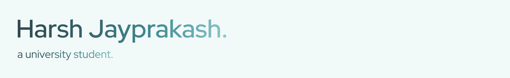

## Hello, there



```pas
course      := "Computer Science";
qual        := "Bachelor's of Science (Honours)";
place       := "University of Winchester";

learning    := "Angular & Typescript";

contact     := "harshjayprakash@outlook.com";
website     := "harshjay.netlify.app [Under Construction]";
```

### Current Languages & Tools


<br/>


<br/>


<br/>


### Repositories Prefixes

```pas
personal     := "hx";
sixth_form   := "bpc";
university   := "uow";
```
