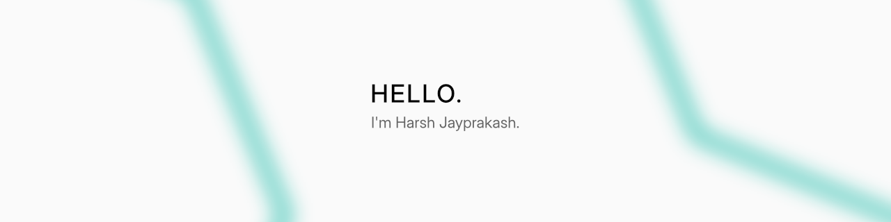

# Hello



```pas
Qual        := 'Bachelors in Computer Science';
Mail        := 'harshjayprakash@outlook.com';
```

## Current Languages & Tools

```pas
OS                  := 'Windows NT', 'Linux'
Editors             := 'VSCode', 'Visual Studio', 'JetBrains IntelliJ'
Tools               := 'Make', 'NodeJS', 'Git'
UIUX                := 'Figma', 'Pen+Paper'

{ languages }
FrontEndWeb         := 'HTML', 'CSS', 'TS', 'Vue', 'Angular'
TraditionalDesktop  := 'C', 'Python', 'Java', 'Visual Basic .NET', 'Pascal'
```

## Additional

[Repository References](./REFERENCE.md)
