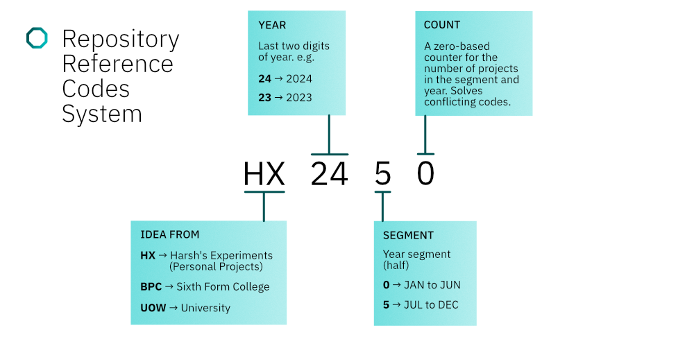

## Hello, there


```pas
Qual        := 'Bachelors in Computer Science';
Mail        := 'harshjayprakash@outlook.com';
```

### Current Languages & Tools

```pas
OperatingSystems    := ('Windows NT', 'Linux');
CodeEditors         := ('VSCode', 'Visual Studio','JetBrains');
Tools               := ('Make', 'Node.JS', 'WSL', 'VMware Workstation');
Languages           := ('C', 'Python', 'Java', 'TypeScript', 'HTML', 'CSS', 
                        'Pascal', 'Visual Basic .NET')
Frameworks          := ('Angular', 'Vue')
```

<details>
<summary><strong>Repository Reference Code System (RRCS)</strong></summary>
Each project/repository has a reference code attach to it describing when and if was some
sort of assignment or personal project. Below shows a figure breaking down the code
`HX 2450`. (Inspired by Processor Naming).


</details>

<details>
<summary><strong>Repository Git Flow System</strong></summary>
Each repository uses some form of git branch, if development is still ongoing. The table
below shows all the potential branches.

<br />
<br />

| Branch      | Description                                        |
| :---------- | :------------------------------------------------- |
| `main`      | Most stable version of the project.                |
| `hotfix`    | For urgent fixes that require immediate attention. |
| `next`      | A preparatory branch.                              |
| `dev`       | Active development branch.                         |
| `feature/*` | Individual branches for developing new features.   |
| `rewrite/*` | Rewrite branch.                                    |
| `gh-pages`  | For GitHub Pages deployment.                       |

</details>