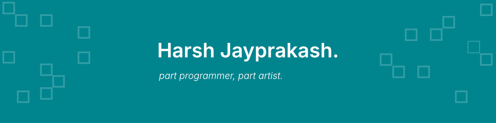

## Hello, there



```pas
Qual        := 'Bachelors in Computer Science';
Mail        := 'harshjayprakash@outlook.com';
Learning    := 'Angular, TypeScript & Windows API';
```

### Current Languages & Tools

```pas
LanguagesAndTools = (
    'Windows', 'Linux'
    'VSCode', 'JetBrains',
    'C', 'Python', 'Java', 'HTML', 'CSS', 'TypeScript',
    'Angular'
)
```

### Repository Prefixes


