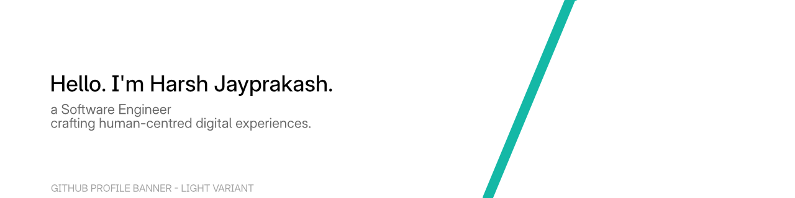

# Hello

<picture>
  <source media="(prefers-color-scheme: dark)" srcset="./assets/gh-greeting-dark-raster.png">
  <source media="(prefers-color-scheme: light)" srcset="./assets/gh-greeting-light-raster.png">
  
</picture>

## About

Hi, I'm Harsh Jayprakash, a software engineer who enjoys the craft of programming -
focusing on human-centred, functional and thoughtful digital experiences. I also like
creating diagrams following a unified visual languages.

```pascal
const
  Qual         = 'Bachelors in Computer Science';
  Mail         = 'harshjayprakash@outlook.com';
  Role         = 'Looking for work.';

  WorkingOn    = ( 'experimental-blok :: next v5.0', 
                   'harshjayprakash.github.io :: gathering ideas' );
```

## Current Languages & Tools

```pascal
const
  OS                = ( 'Windows NT', 'GNU+Linux' );
  Editors           = ( 'VSCode', 'Visual Studio', 'JetBrains IntelliJ' );
  Tools             = ( 'Make', 'NodeJS', 'Deno', 'Git' );
  UIUX              = ( 'Figma', 'Analogue Pen+Paper' );

  FrontEndWebDev    = ( 'HTML', 'CSS', 'TypeScript', 'Vue', 'Angular' );
  DesktopDev        = ( 'C', 'Python', 'Java', 'Visual Basic .NET', 'Pascal' );
```
